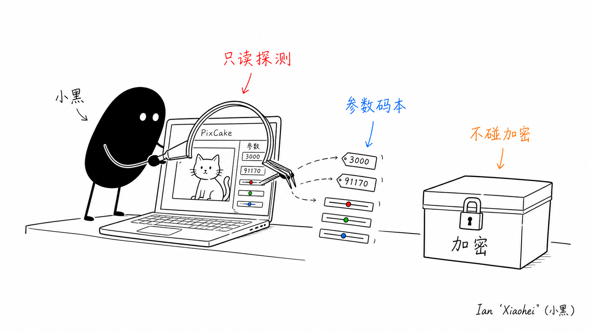

<p align="center">
  
</p>

# pixcake-use

只读探测本地 PixCake 的工具:定位它的数据、给文件和 SQLite 库抓快照、在你做完一次界面操作后比对前后差异,从中把 PixCake 的调色参数格式(`pf` 参数)逆出来。配套一个经过验证的参数码本,还能从 RAW 原图解码预览、离线近似渲染一张照片的调色效果。

针对你自己的账号、你自己的照片。**全程只读 PixCake 数据**(SQLite 一律 `mode=ro`),写操作只落在你自己的编辑记录上且每次先备份。不绕过登录、付费、配额、签名,也不解密 PixCake 的加密资源(FXIP)。

## 安全边界

- 默认只读。`snapshot` / `diff` / `schema` / `tables` / `rows` / `params` / `photos` 不写任何 PixCake 数据。
- `apply-recipe` / `apply-current-record` 会写你自己照片的编辑参数(palette JSON + 对应 db 行),写前自动备份整个 SQLite family 和 palette 文件。
- 不解密 FXIP。PixCake 的预览缓存和相机色彩 LUT 用同一种加密容器封装,破它等于绕过厂商对专有内容的保护——这条不做。
- RAW 解码走 macOS 自带 `sips`,离线渲染是标准图像运算的**近似**,不是 PixCake 渲染引擎的逐像素复刻。

## 安装

只依赖 Python 标准库;离线渲染预览(`photos --graded`)另需 Pillow + numpy。

```bash
git clone https://github.com/leeguooooo/pixcake-use
cd pixcake-use
python3 -m pixcake_use doctor                 # 检测路径与运行状态
pip install -e '.[render]'                     # 可选:启用 --graded 离线渲染
```

## 用法

抓快照、做一次操作、比对差异(这是把"某个滑块对应哪个 `pf`"逆出来的核心手法):

```bash
python3 -m pixcake_use snapshot --name before
# 在 PixCake 里只改一个参数,保存预设或同步到选中图片
python3 -m pixcake_use snapshot --name after
python3 -m pixcake_use diff snapshots/before.json snapshots/after.json
```

定时窗口里完成一次界面操作:

```bash
python3 -m pixcake_use watch --seconds 30 --name exposure-plus
```

列出照片、解码 RAW 预览、离线渲染近似调色:

```bash
python3 -m pixcake_use photos                              # 列出每张:位置/id/是否已编辑/recipe 摘要
python3 -m pixcake_use photos --extract previews --graded  # 导出可看 JPEG + 近似调色预览
```

从一个配置行提取 `pf` 参数:

```bash
python3 -m pixcake_use params \
  "$HOME/Library/Application Support/PixCake-qt_pro/db/user_<id>/project_<id>/project.db" \
  presets_config_detail --id 2
```

给自己照片的当前编辑记录套一个 recipe(写前备份):

```bash
python3 -m pixcake_use apply-current-record \
  "$HOME/Library/Application Support/PixCake-qt_pro/db/user_<id>/project_<id>/project.db" \
  --thumbnail-id 1 --recipe recipes/low-key-cat-publish.json
```

## 工作流

只读探测拿到结构 → 把 `pf` 数字对到人类参数名(码本)→ 离线把 recipe 渲染成近似预览看效果 → 写回自己照片让 PixCake 真实渲染。

## 参数码本

`pf` 是 palette JSON(`Common.Params`)里的数字参数,每个形如 `{pf, fe|ie|se|ae}`;`fe` 取 0–1,0.5 为中性,`ae` 是色调曲线的点数组。`src/pixcake_use/codebook.py` 里的映射不是猜的,来源分两类:

**应用自标注(confirmed)**:PixCake 自己在预设的嵌套 `StrParams` 里给每个 `pf` 写了 `name` 字段。据此确认:

| pf | 含义 | pf | 含义 |
|---|---|---|---|
| 3000 | Exposure 曝光 | 3020 | Whites 白色 |
| 3002 | Contrast 对比度 | 3021 | Blacks 黑色 |
| 3003 | Highlights 高光 | 3006 | Saturation 饱和度 |
| 3004 | Shadows 阴影 | 90014 | Vibrance 自然饱和 |
| 3007 | Temperature 色温 | 21001 | 亮度 / EnhanceEditLuma |
| 3008 | Tint 色调 | 90069/70/71 | RGB 色调曲线 |

**经验确认(watch/diff 实测)**:在一张照片上单独拖一个滑块、比对哪个 `pf` 变了——

- HSL 颜色混合器在 `91170–91193`,共 24 个连续 id,排布为**色优先**:每个颜色一段连续的 `[色相, 饱和度, 明度]`,颜色顺序 Red, Orange, Yellow, Green, Aqua, Blue, Purple, Magenta。公式 `id = 91170 + 颜色序号×3 + 属性序号`。
- 细节滑块:Texture 纹理=`44799`,Clarity 清晰度=`3022`,Sharpening 锐化=`90016`,Dehaze 祛雾=`90152`,Grain 颗粒=`8200`,Vignette 暗角=`91107`。
- 亮度滑块写 `21001`(即 EnhanceEditLuma),没有独立的 Brightness `pf`。
- `90073/90074/90075/90076/90077/90078` 出现在预设里但全无名字,保持未命名。

## 工作原理

- **WAL 正确性**:PixCake 的 SQLite 跑在 WAL 模式,运行中未提交的改动留在 `-wal` 旁文件里。只读连接只看已提交帧,所以 PixCake 开着时读到的行数可能是上一次提交的状态。`doctor` / `snapshot` / `watch` 在检测到 PixCake 进程时会向 stderr 报警;diff 会把 `-wal` / `-shm` 旁文件的变化单独列出。要干净的 diff:退出 PixCake → 操作 → 重开 → 抓快照。
- **照片预览**:`photos` 把 `thumbnail` + `thumb_opt_record` + palette JSON 拼成每张照片的视图;原图(RAW)用 `sips` 解码;`--graded` 用 palette recipe 离线近似渲染。
- **不读 FXIP**:PixCake 的 `_250` / `_4000` 预览缓存是加密的 `FXIP` 容器,本工具不碰。

## 开发

```bash
pip install -e '.[dev]'
python3 -m pytest        # 或:python3 -m unittest discover -s tests
ruff check . && mypy src
```

## 免责

本项目用于对你拥有合法逆向权的对象(你自己的账号、你自己的照片)做本地自动化与格式分析。不用于绕过任何商业产品的付费、签名或服务端校验。
